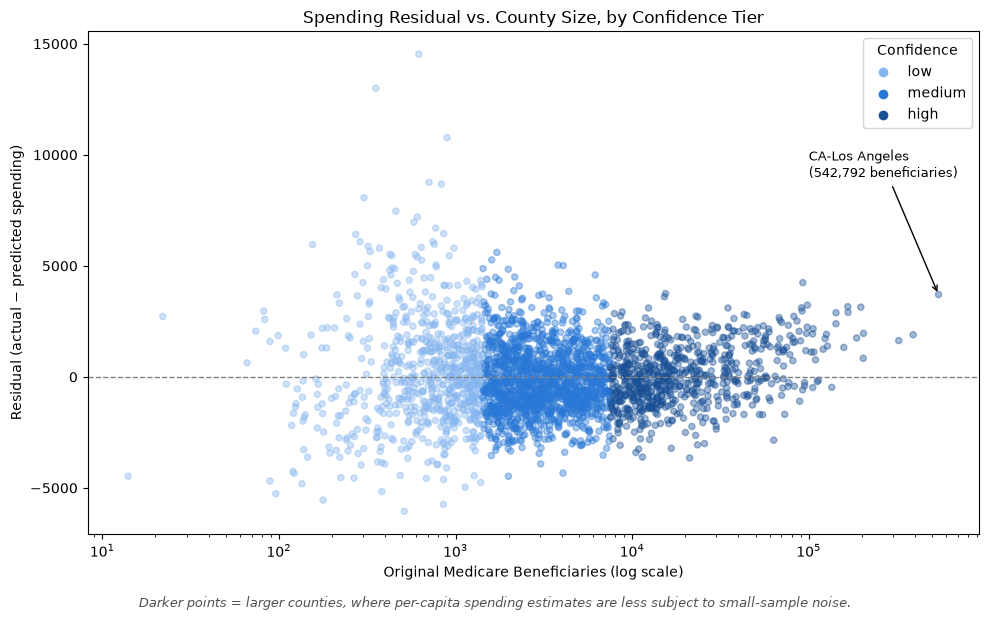

# Medicare Spending vs. Diabetes Prevalence Analysis

Comparing CMS spending and CDC disease burden data to identify spending vs. need mismatches in 2,954 counties

`Python` `pandas` `scikit-learn` `Jupyter`

## TL;DR

> **Business Problem:** Medicare spending doesn't always track disease burden. Some counties spend far more, or far less, than their diabetes prevalence would predict.
>
> **Key Finding:** Los Angeles County, the largest Medicare population in the dataset, has the highest total dollar impact at ~$2.01B and a high per-capita residual at ~$3,708.
>
> **Impact:** Counties similar to LA, where higher sample sizes increase confidence in spending anomalies, are exactly the ones that warrant an audit or utilization review.

## Tech Stack & Skills

- Multi-source data integration & quality assurance: joined CMS Medicare geographic spending files with CDC PLACES diabetes prevalence data via FIPS codes, with outer-join validation (`indicator=True` auditing) to catch silent data loss and resolve FIPS leading-zero truncation
- Linear regression and residual analysis to establish expected spending based on disease prevalence, then identify outliers unexplained by that baseline
- Small-sample noise reduction & confidence tiering: beneficiary-count threshold testing (`pd.cut`) to identify and separate tier(s) with credible statistical signal
- Financial impact quantification: converted per-capita statistical residuals into total dollar metrics to translate findings into business-relevant magnitude
- Data visualization: log-scale scatter plot with ordinal confidence-color encoding, translating regression output into a user-friendly view where it is easy to notice counties that are outliers and the confidence tiers they are located in

## Visual Showcase

Notice that the scatter plot below is in a funnel shape, indicating that statistical noise shrinks as sample size increases, and that LA County stands out within the most reliable tier.



## Business Context & Data Sources

> Medicare is a massive tax-payer-funded program. A systemic spending vs. needs mismatch means wasted public funds on one side and potentially underserved patients on the other. Utilization reviews and care-quality audits help to understand various factors that are at play. If appropriate, resources can be redistributed and/or access to primary/preventative care can be improved.

- **PLACES County Data (GIS Friendly Format)** (CDC) — county-level diabetes prevalence, 2023 BRFSS-based, 2025 release. [CDC PLACES Data Portal](https://www.cdc.gov/places/tools/data-portal.html)
- **Medicare Geographic Variation Public Use File** (CMS) — county-level standardized per-capita Medicare spending and beneficiary counts, 2014–2024 panel filtered to 2023. [CMS Medicare Geographic Variation](https://data.cms.gov/summary-statistics-on-use-and-payments/medicare-geographic-comparisons/medicare-geographic-variation-by-national-state-county)

## Methodology & Cleaning

> **FIPS leading-zero truncation.** Both join-key columns (`CountyFIPS`, `BENE_GEO_CD`) load as integers by default, silently dropping leading zeros (e.g., Alaska's `02013` becomes `2013`). Fixed at load time by forcing both to load as strings:
> ```python
> cms = pd.read_csv("...", dtype={"BENE_GEO_CD": str})
> ```
>
> **CMS placeholder rows.** The CMS file includes 51 fake per-state summary rows (e.g., `AK-UNKNOWN`) that aren't real counties. Removed by filtering on the specific `-UNKNOWN` text pattern, rather than a broader rule, so as not to also drop the real (and legitimately small/suppressed) `HI-Kalawao` county:
> ```python
> cms_clean = cms_clean[~cms_clean['BENE_GEO_DESC'].str.contains('-UNKNOWN')]
> ```
>
> **KY/PA data gap.** PLACES has no 2023 BRFSS diabetes prevalence data for Kentucky or Pennsylvania. Rather than substitute or estimate, these states were acknowledged and excluded to preserve methodological consistency.
>
> **Suppressed values.** CMS suppresses some spending/beneficiary figures for very small counties (marked `*`), which forces the entire numeric column to load as text. Fixed by coercing to numeric and letting suppressed values become `NaN`:
> ```python
> cms_clean['TOT_MDCR_STDZD_PYMT_PC'] = pd.to_numeric(cms_clean['TOT_MDCR_STDZD_PYMT_PC'], errors='coerce')
> ```
>
> **Merge validation.** Before joining on `CountyFIPS` (PLACES) / `BENE_GEO_CD` (CMS), checked both keys for duplicates (none found on either side) and ran an outer-join audit to confirm the match rate:
> ```python
> audit = pd.merge(places_clean, cms_clean, left_on='CountyFIPS', right_on='BENE_GEO_CD', how='outer', indicator=True)
> audit['_merge'].value_counts()
> ```
> Result: 2,955 matched, 191 CMS-only (187 counties in KY/PA without diabetes data, 3 in the Virgin Islands, outside PLACES's geographic scope, 1 in TX — Loving County, the least populous county in the US, population ~60-100 — likely too small for BRFSS's estimation methodology to produce a reliable figure), 1 PLACES-only. The actual merge used an inner join to keep only counties present in both sources:
> ```python
> result = pd.merge(places_clean, cms_clean, left_on='CountyFIPS', right_on='BENE_GEO_CD', how='inner')
> ```

## Detailed Findings & Nuance

**High-confidence tier / South Florida cluster:**
> Looking at the chart under Total Dollar Impact, you'll notice LA County is at the top with ~$2.01B and has a high per-capita residual at ~$3,708, which warrants further exploration. Under Per-Capita Residuals, five Florida counties, three in the Tri-County area (3 out of the top 6 on the list), and two in Tampa Bay/Central Florida take up half of the list. Meanwhile, Wichita TX, Grayson TX, Suffolk NY, and Bossier LA are counties outside the FL cluster that also warrant a look. All of these counties are spending well above what disease burden predicts and justify further investigation. Due to the high sample size of medical beneficiaries in these counties, these findings are much less likely due to statistical noise and therefore are considered in a high-confidence tier.

| County | Per-Capita Residual | Total Dollar Impact |
|---|---|---|
| FL-Miami-Dade | $4,244 | $392,825,419 |
| TX-Wichita | $3,752 | $58,002,567 |
| CA-Los Angeles | $3,708 | $2,012,492,829 |
| TX-Grayson | $3,608 | $54,945,901 |
| FL-Broward | $3,233 | $317,759,851 |
| FL-Palm Beach | $3,164 | $525,812,887 |
| NY-Suffolk | $3,143 | $619,490,605 |
| FL-Pinellas | $3,111 | $283,177,182 |
| FL-Seminole | $3,105 | $108,285,499 |
| LA-Bossier | $3,101 | $38,395,954 |

**Medium-confidence tier / rural TX-OK-LA-KS cluster:**
> The medium tier table is more evenly distributed compared to the high tier table with TX, LA, and OK contributing 3 counties each and KS with one. This tier's counties trend more rural, consistent with their lower beneficiary counts (1,424–7,506, vs. >7,506 for the high-confidence tier).

| County | Per-Capita Residual | Total Dollar Impact |
|---|---|---|
| TX-Runnels | $5,606 | $9,608,100 |
| LA-Bienville | $5,268 | $8,440,134 |
| OK-Caddo | $5,034 | $19,158,553 |
| LA-Washington | $5,012 | $20,400,222 |
| KS-Thomas | $4,878 | $6,985,181 |
| LA-LaSalle | $4,848 | $9,642,694 |
| OK-Bryan | $4,591 | $28,374,807 |
| OK-Pawnee | $4,498 | $9,725,148 |
| TX-Clay | $4,484 | $7,551,144 |
| TX-Wilbarger | $4,392 | $6,605,699 |

**Underserved counties / Pacific-West pattern:**
> In the high confidence underserved table below, you'll notice that HI, AK, OR, WA, and CA are on the list, primarily Pacific and West coast states. The underspending matters because these counties potentially have underserved patients and access to care issues. It's also notable that 6 of 10 counties (OR–Klamath, OR–Douglas, WA–Stevens, CA–Humboldt, CA–Siskiyou, HI–Hawaii) are geographically isolated and trend rural. A similar Western pattern holds for the lower tiers, trending more interior/Southwest, with more noise.

| County | Per-Capita Residual | Total Dollar Impact |
|---|---|---|
| HI-Hawaii | -$3,647 | -$77,119,000 |
| AK-Fairbanks North Star | -$3,608 | -$41,251,715 |
| OR-Klamath | -$3,406 | -$35,758,094 |
| HI-Maui | -$3,250 | -$35,357,505 |
| OR-Douglas | -$3,214 | -$53,513,250 |
| WA-Stevens | -$3,079 | -$26,331,093 |
| WA-Yakima | -$3,060 | -$71,779,853 |
| CA-Humboldt | -$3,002 | -$77,089,835 |
| HI-Honolulu | -$2,849 | -$180,310,057 |
| CA-Siskiyou | -$2,822 | -$35,398,818 |

## Limitations & Future Work

> This notebook runs cleanly from top-to-bottom via Restart Kernel and Run All.
>
> **Limitations:**
> - The regression was not validated; no train/test split was performed. It is only explanatory and not a predictive model.
> - No risk adjustment was performed. The model uses diabetes prevalence as the only predictor of expected spending, not other demographic or health factors that can legitimately drive cost differences between counties.
> - Scope exclusions (see Methodology): the Virgin Islands, Kentucky, Pennsylvania, and Loving County, TX were excluded for limited or missing data.
> - The low-confidence tier (739 counties, ≤1,424 beneficiaries) was not used in any headline finding as it is the noisiest third of the data.
>
> **Future work:**
> - Explore "underserved" counties' AHRQ PQI16 diabetes amputation rate as an independent, non-Medicare-spending check to see if they are actually seeing worse health outcomes.
> - Explore "money-pit" counties' service-category spending mix (IP/OP/SNF/HH/HOSPC/DME breakdown) to see whether they are overspending on a particular type of care.
>
> If given the choice, I would prioritize the amputation rate check first since it's lower-effort and more patient-outcome-focused, then move to the money-pit spending breakdown.

## Repo Navigation

| File | Description |
|---|---|
| `README.md` | This file — project overview, methodology, and findings |
| `medicare_diabetes_spending_analysis.ipynb` | Full analysis notebook: data cleaning, regression, residual and confidence-tier analysis |
| `merged_diabetes_spending_2023.csv` | Cleaned, merged dataset (PLACES + CMS) produced by the notebook |
| `residual_by_confidence.png` | Exported figure referenced in the Visual Showcase section |

> Raw source files (PLACES, CMS) aren't included in this repo — see Business Context & Data Sources above for links to download them directly.
